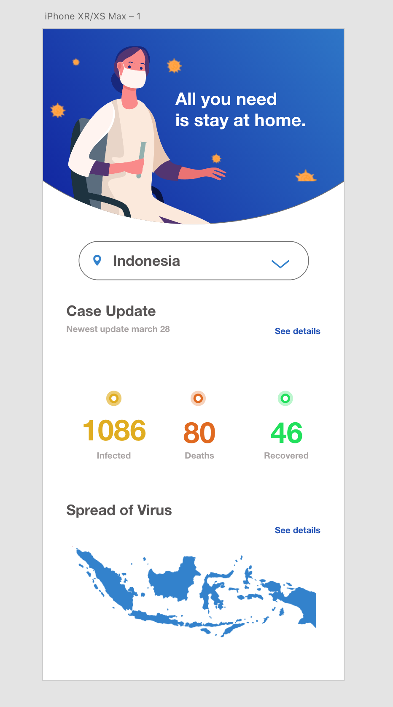
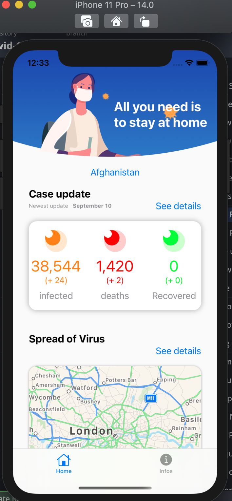
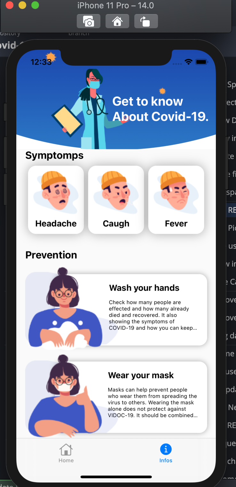
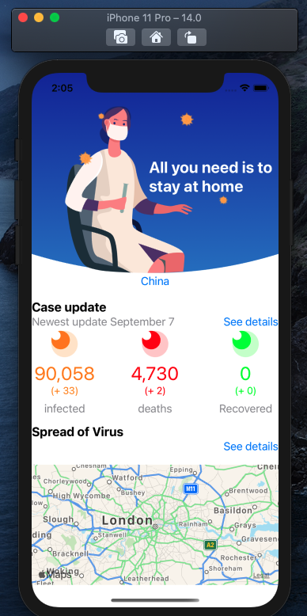

# COVID-19
Check how many people are effected and how many already died and recovered. It also showing the symptoms of COVID-19 and how you can keep yourself safe. 

The idea and design come from this video : https://www.youtube.com/watch?v=zx6uMCoW2gQ from **The Flutter Way** 
where the autor create the app with **Flutter** but we will just reuse its design and its assets and do it with **Swift**

Check his Youtube channel, great content.

**Notice** Changing framework from UIKit to SwiftUI

## Purpose of this app

Trying knew things and improving my knowledge of swift and building apps.

learnings/improving : 
- Designing app with Adobe XD
- Design business logic with UML
- Create the business logic 
- Learn how to inject business logic into the UI 
- improve in using Interface Builder and auto-layout
- Improve in data request
- improve in buildings app

## Tech used
Previously was using UIkit for view, 
[PromiseKit](https://github.com/mxcl/PromiseKit) and [Almofire](https://github.com/Alamofire/Alamofire) for networking. 
Change to reactive programming.

-  [SwiftUI](https://developer.apple.com/xcode/swiftui/)
-  [Combine](https://developer.apple.com/documentation/combine)
-  [GoogleMaps SDK iOS](https://developers.google.com/maps/documentation/ios-sdk/overview?hl=fr)

 
 ## App design
 
 
 **Notice** : screenshot of the youtube video
The app will need to look like this

## App Advancement

### Right now the app is looking like this  (11 September 2020)

### 7 September 2020

